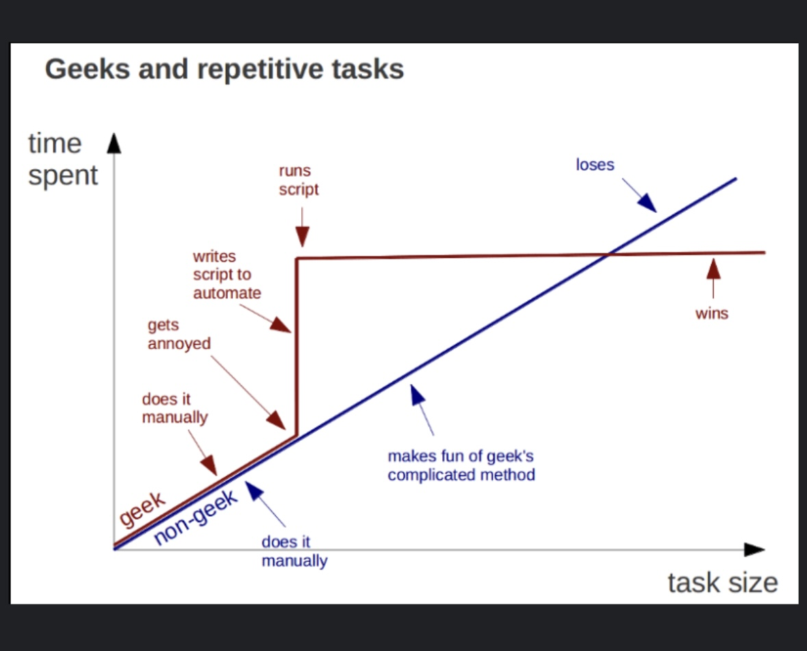

# C0d3_C1U8

Welcome to C0d3_C1U8! This C1U8 is centered around assisting wet-lab biologists learn and grow in data science in this every growing data heavy scientific realm. The goal of this work is provide tutorials, code and discussion to teach and build confidence in coding.

## About Me

I am current 4th year PhD candidate hailing from the Midwestern USA. I completed my undergraduate (Biomedical sciences) and Masters (Molecular Bio., Microbio., and Biochemistry) at Southern Illinois University. I am a self taught programmer with a broad interest in computer science who learned to code by trial and error. My programming began as an undergraduate when I inherited next-generation sequencing data from 16S sequencing of environmental bacterial microbiomes investigating environmental remediation and sustainable aquaculture. Admittedly, I struggled tremendously learning to anaylze sequencing data leading me to regularly wipe out and restart projects followed by incessant googling for solutions. This trial by fire greatly inspired me to write this guide to assist others in navigating the coding sphere of computational biology. Circa 2016 I was fortunate enough to begin working with a laboratory who purchased, a then groundbreaking technology, the oxford nanopore MinION for long read direct DNA sequencing. Our group used this to sequence genomes of novel deep-subsurface bacteria isolated from gold mines and nuclear test sites (bombs not reactors). I was then tasked to take this new long read sequencing data and previously generated genomic next-generation sequencing data and combine them into an accurate bacterial genome for a newly isolated bacterium. Learning to analyze the MinION data at its genesis captured my fascination and spawned my love for computational biology. Since then, I have moved on the work wih proteomics data and broaden my horizon to include building micro-PCs (because I am a microbiologist), databases designs, pipeline building, and automation.

With that said, I intend to deliver a guide that provides a bare minimum foundation for you to begin learning the ropes. I am not a perfect human, my guides may have errors or be suboptimal. Errors will be corrected, alternative approaches will be acknowledged but most importantly, the code will work. I am not a programmer, I am a biologist so my perspective will differ. What gives me the credentials to teach these topics? Nothing. There is no licensure for this. But I tutored student athletes for 4 years in undergrad, TA'd introductory microbiology labs for 2 years and mentored undergraduates for two years in my masters, and continued to briefly TA and mentor in my PhD. More importantly, I failed countless times trying to learn to code, set up the proper environments, and document my progress which I will now pass onward to you.

Learning to code is an iterative process, you won't get it right the first few times, you will doubt yourself, you will be upset. This resource is here assist your initial journey with guidance to minimize the sting. All the code and guides are avialble free of charge, no need to use me or this page in any references. I discourage citations for two reasons: 1. I am not an expert and 2. code in the information age is for everyone to use so feel to copy and paste or use anything I post on this page without guilt or worry.

Feel free to leave a message or comment on any questions, comments, or concerns. Happy coding and welcome to the new hottest C1U8 in NYC!

## Table of Contents

1. [Introduction]() 

2. [Getting Started in VS Code](./Getting%20Started%20in%20VS%20Code/SwitchingFromR/Introduction.md) 

2.1-2.3

   2.1. [Switching from RStudio to VS Code](./Getting%20Started%20in%20VS%20Code/SwitchingFromR/Introduction.md) 
   2.2. [Setting up Python in VS Code]() 
   2.3. [Other recommended VS Code Extenstions]() 
   

3. [Basics of Bioinformatics]() 

3.1-3.5

   3.1. [Understanding File Types and Formats]() 
   3.2. [File Import]() 
   3.3. [Data Cleaning and Organizing]() 
   3.4. [Summarizing Data]() 
   3.5. [Functions, Loops, Decorators]() 
   

4. [Using Existing Tools]() 

4.1-4.4

   4.1. [Command Line Tools and BASH]() 
   4.2. [Read Alignment]() 
   4.3. [Short and Long Read DNA Sequencing]() 
   4.4. [Bacterial Genome Assembly]() 
   

5. [Advanced Topics]() 

5.1-5.4

   5.1. [Automation and Scripting]() 
   5.2. [Database Management]() 
   5.3. [Building a Custom Computer Cluster]() 
   5.4. [Building a Data Dashboard]() 
   

6. [Code Base]() 

6.1-6.5

   6.1. [Manipulating Text]() 
   6.2. [Filtering Data]() 
   6.3. [Parsing Data]() 
   6.4. [Quality of Life]() 
   6.5. [Solving Annoyances]() 
   

